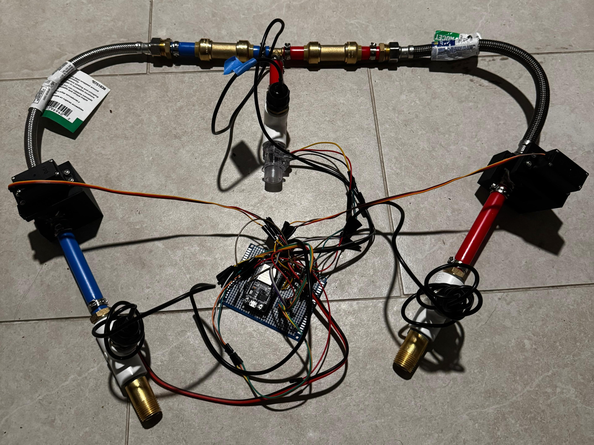
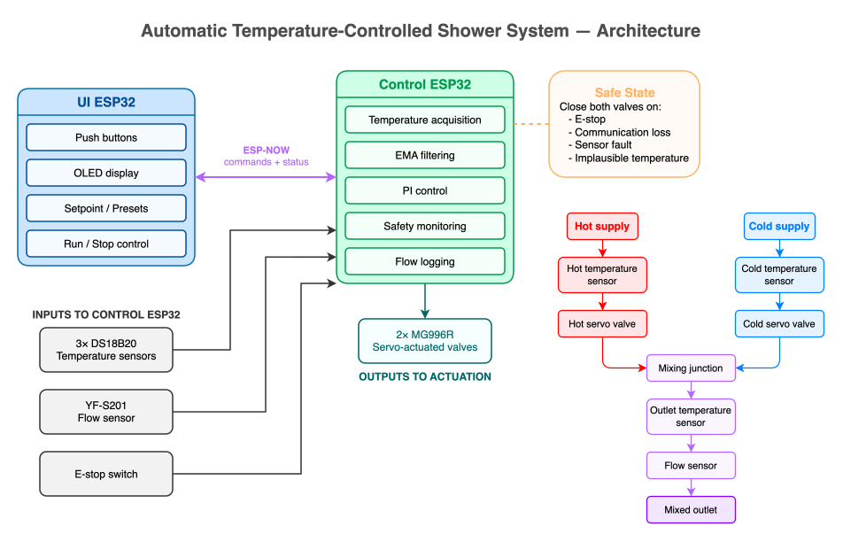
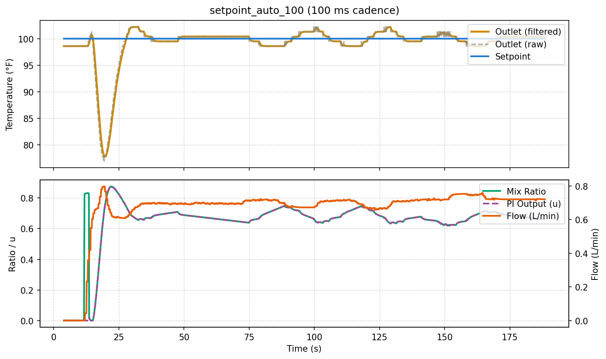

# Automatic Temperature-Controlled Shower

ESP32-based closed-loop system that automatically mixes hot and cold water to maintain a user-selected outlet temperature.

Developed as a three-person NJIT ECE 416 capstone project, the prototype combines embedded control, wireless communication, temperature and flow sensing, servo-actuated valves, and a standalone user interface.



## Results at a Glance

- Stable outlet-temperature regulation within approximately **±1.5°F**
- Dual-ESP32 architecture with wireless ESP-NOW communication
- PI closed-loop temperature control with approximately **10 Hz** control updates
- Three-point temperature sensing at the hot inlet, cold inlet, and mixed outlet
- Servo-actuated hot and cold mixing valves
- CSV telemetry logging and Python-based response analysis
- Demonstrated E-stop, communication-loss, and temperature-sensor fault handling

## System Architecture



The prototype is split across two ESP32s:

- **Control unit** — reads temperature and flow sensors, runs the PI controller, drives the hot/cold valve servos, logs telemetry, and handles safety conditions.
- **UI unit** — provides a 128×64 OLED and five-button interface for setpoint adjustment, presets, run/stop control, and system status.
- **ESP-NOW link** — transfers setpoint and run-state commands to the Control unit and returns outlet-temperature and flow status.

Detailed architecture, configuration, and wiring documentation is available under [`design/`](design/).

## Control and Safety

The final controller uses PI feedback with EMA-filtered temperature measurements, conditional integration for anti-windup, a small setpoint deadband, and output slew limiting.

During startup, the controller estimates an initial hot/cold mixing ratio from the measured inlet temperatures and requested setpoint. Closed-loop PI regulation then adjusts the valve mixture based on outlet-temperature error.

Firmware-level protections stop normal operation and command both valves closed when the system detects:

- an active E-stop;
- loss of the UI communication link while running;
- missing, invalid, or implausible temperature readings;
- rapid temperature changes on the hot or cold inlet lines.

The selectable setpoint is limited to **80–120°F**. This is a user-command range, not an independent measured-temperature cutoff.

The E-stop is monitored by the Control ESP32 and triggers the firmware safe state; it is not an independent hardwired servo-power disconnect.

## Validation

Closed-loop testing was logged to CSV and analyzed with Python. Validation artifacts include raw datasets, analysis scripts, response plots, subsystem tests, safety demonstrations, and final-system video evidence.



Additional closed-loop plots cover multiple setpoints and setpoint-change testing under [`validation/control/plots/`](validation/control/plots/).

### Final System Demo

The final integrated demonstration is split into three video segments:

- [Final system demo — Part 1](validation/control/videos/final_system_demo_part1.mp4)
- [Final system demo — Part 2](validation/control/videos/final_system_demo_part2.mp4)
- [Final system demo — Part 3](validation/control/videos/final_system_demo_part3.mp4)

### Safety Demonstrations

- [E-stop response](validation/control/videos/safety_estop_demo.mp4)
- [ESP-NOW link-loss response](validation/control/videos/safety_link_loss_demo.mp4)
- [Temperature-sensor fault response](validation/control/videos/safety_sensor_fault_demo.mp4)

Flow sensing was integrated for telemetry and logging, but the flow conversion factor was not experimentally calibrated; reported flow values should therefore be treated as estimates rather than validated measurements.

## Project Structure

```text
temperature-controlled-shower-system/
├── firmware/
│   ├── common/          # Shared ESP-NOW protocol and setpoint configuration
│   ├── control/         # Sensors, PI control, valves, flow sensing, safety logic
│   ├── ui/              # Buttons, OLED interface, and ESP-NOW communication
│   ├── libraries/       # Local reusable firmware components
│   ├── test_sketches/   # Bring-up and subsystem test firmware
│   └── tools/           # Sensor discovery and servo calibration tools
├── design/
│   ├── diagrams/        # System architecture and editable diagram source
│   ├── config/          # Subsystem configuration and implementation notes
│   └── wiring/          # Physical wiring documentation
├── mechanical/
│   ├── cad/             # Servo mount and valve coupler CAD
│   └── photos/          # Assembly, mechanical-integration, and demo photos
└── validation/
    ├── bringup/         # Hardware and peripheral bring-up evidence
    ├── communication/   # ESP-NOW and setpoint-transfer evidence
    ├── measurement/     # Temperature/flow data, plots, and scripts
    └── control/         # Closed-loop data, plots, scripts, and videos
```

See [`design/README.md`](design/README.md) for system-design documentation, [`mechanical/README.md`](mechanical/README.md) for physical integration, and [`validation/README.md`](validation/README.md) for test and validation artifacts.

## Firmware

The main firmware entry points are:

- [`firmware/control/control.ino`](firmware/control/control.ino) — Control ESP32
- [`firmware/ui/ui.ino`](firmware/ui/ui.ino) — UI ESP32

Configuration is divided between:

- [`firmware/common/config.h`](firmware/common/config.h)
- [`firmware/control/config.h`](firmware/control/config.h)
- [`firmware/ui/config.h`](firmware/ui/config.h)

The project uses the Arduino ESP32 framework with OneWire, DallasTemperature, ESP32Servo, U8g2, and ESP-NOW.
