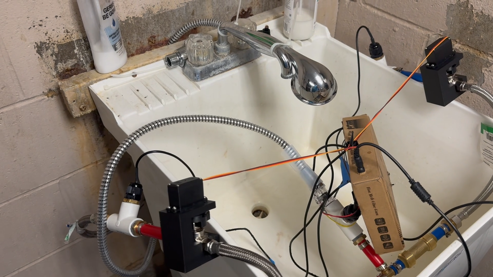

# Mechanical Integration

The prototype uses servo-driven hot and cold valves with custom mechanical parts connecting the MG996R servos to the valve assemblies.

The physical system integrates the valve assemblies, temperature-sensor fittings, mixing plumbing, and outlet flow sensing used for closed-loop temperature-control testing.

## Structure

- [`cad/`](cad/) — Fusion 360, STEP, and STL files for the servo mount and valve coupler
- [`photos/`](photos/) — prototype assembly, wiring, mechanical-integration, and final-demo photos

## Final Demo Setup

The final demo setup shows the integrated prototype connected to a physical water supply for system testing.

The system remained an open laboratory prototype; a completed enclosure and waterproofing validation were not part of the finished implementation.

## Related Documentation

- [`design/`](../design/) — electrical connections and subsystem configuration
- [`validation/`](../validation/) — bring-up, measurement, communication, and closed-loop control evidence
